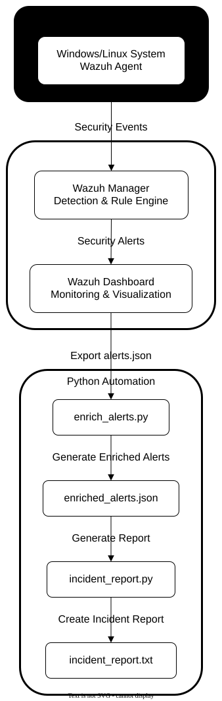
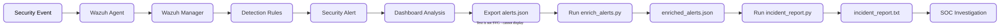

# 🛡️ Wazuh SIEM Alert Enrichment & Incident Reporting


## 📌 Overview

This project demonstrates a Security Information and Event Management (SIEM) workflow using Wazuh and Python automation. It enriches exported Wazuh alerts with additional investigation context, calculates risk levels, extracts File Integrity Monitoring (FIM) information, maps MITRE ATT&CK techniques, and generates structured incident reports.

The project simulates a SOC analyst workflow from event detection to automated reporting.

---

## ✨ Features

- Real-time Wazuh SIEM monitoring
- Alert enrichment using Python
- Risk score calculation
- MITRE ATT&CK mapping
- File Integrity Monitoring (FIM) extraction
- MD5, SHA1 and SHA256 hash extraction
- Automated incident report generation
- Professional technical documentation

---

## 🏗️ System Architecture



---

## 🔄 Project Workflow



---

## 📂 Project Structure

```text
wazuh-enrichment/
├── diagrams/
├── docs/
├── reports/
├── screenshots/
├── source_logs/
├── enrich_alerts.py
├── incident_report.py
├── enriched_alerts.json
├── README.md
├── LICENSE
├── requirements.txt
└── .gitignore
```

---

## ⚙️ Technologies Used

- Wazuh SIEM
- Ubuntu Server
- Python 3
- Visual Studio Code
- File Integrity Monitoring (FIM)
- MITRE ATT&CK Framework

---

## 🚀 Installation

```bash
git clone https://github.com/Mahesh-830/wazuh-siem-incident-reporting.git
cd wazuh-enrichment
```

Run the enrichment script:

```bash
sudo python3 enrich_alerts.py
```

Generate the incident report:

```bash
sudo python3 incident_report.py
```

---

## 📊 Sample Output

### Enriched Alerts

```json
{
  "risk_score": "High Risk",
  "mitre": "T1565",
  "file": "/var/www/html/index.php"
}
```

---

## 📚 Documentation

Detailed documentation is available in the `docs/` directory.

- Project Overview
- System Architecture
- Installation & Configuration
- Workflow
- Dashboard Analysis
- Python Alert Enrichment
- Testing & Validation
- Troubleshooting
- Future Enhancements

---

## 📄 License

This project is licensed under the MIT License.

---
<br>

## 👤 Author

**Developed by:** Mahesh Tilot

**Domains:** Cybersecurity | SIEM | Python | Cloud Security