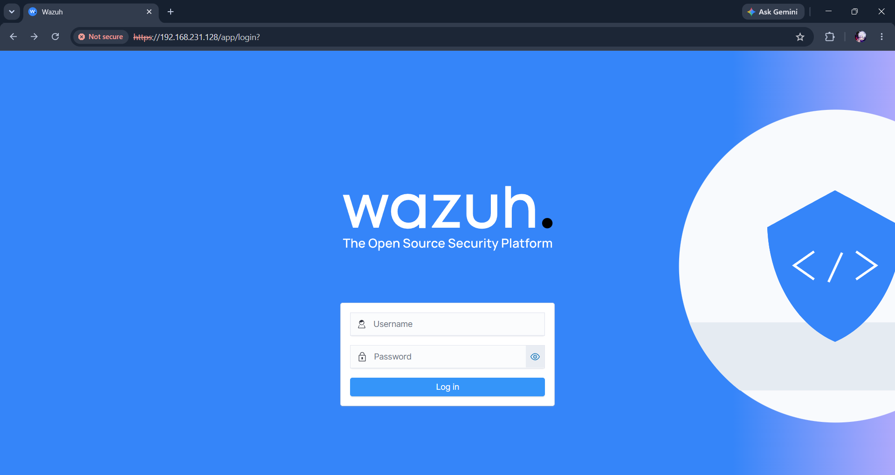

# System Architecture

**Version:** 1.0

**Author:** Mahesh Tilot

---

# Purpose

This document describes the architecture of the Wazuh SIEM Alert Enrichment & Incident Reporting project. It explains how security events are collected, processed, enriched, and transformed into investigation-ready reports.

The architecture combines Wazuh SIEM with Python automation to demonstrate a practical Security Operations Center (SOC) workflow.

---

# Architecture Overview

The project consists of two major components:

1. **Security Monitoring Layer**
   - Wazuh SIEM
   - Wazuh Agent
   - Security Event Collection
   - File Integrity Monitoring (FIM)

2. **Automation Layer**
   - Python Alert Enrichment
   - Risk Score Calculation
   - MITRE ATT&CK Mapping
   - Incident Report Generation

Together, these components automate the process of collecting, enriching, and reporting security events.

---

# High-Level Architecture

```text
                  +---------------------------+
                  |      Monitored System     |
                  |  (Windows / Linux Agent)  |
                  +-------------+-------------+
                                |
                                | Security Events
                                |
                                v
                  +---------------------------+
                  |        Wazuh Agent        |
                  +-------------+-------------+
                                |
                                |
                                v
                  +---------------------------+
                  |       Wazuh Manager       |
                  +-------------+-------------+
                                |
                                |
                                v
                  +---------------------------+
                  |    Wazuh Dashboard SIEM   |
                  +-------------+-------------+
                                |
                                | alerts.json
                                |
                                v
                  +---------------------------+
                  | Python Enrichment Engine  |
                  +-------------+-------------+
                                |
        +-----------------------+------------------------+
        |                       |                        |
        v                       v                        v
+---------------+     +-------------------+     +----------------+
| Risk Scoring  |     | MITRE ATT&CK Map  |     | FIM Extraction |
+---------------+     +-------------------+     +----------------+
        \                       |                       /
         \                      |                      /
          +---------------------+---------------------+
                                |
                                v
                  +---------------------------+
                  |  enriched_alerts.json     |
                  +-------------+-------------+
                                |
                                v
                  +---------------------------+
                  | Incident Report Generator |
                  +-------------+-------------+
                                |
                                v
                  +---------------------------+
                  | incident_report.txt       |
                  +---------------------------+
```

---

# Architecture Components

## 1. Wazuh Agent

The Wazuh Agent monitors the endpoint and forwards security events to the Wazuh Manager. It is responsible for collecting operating system logs, file integrity events, authentication events, and other security-related information.

---

## 2. Wazuh Manager

The Wazuh Manager receives events from connected agents, applies detection rules, generates alerts, and stores security information for visualization and analysis.

---

## 3. Wazuh Dashboard

The Wazuh Dashboard provides a graphical interface for monitoring alerts, analyzing security events, viewing MITRE ATT&CK mappings, investigating File Integrity Monitoring (FIM) events, and reviewing custom dashboards.

### Dashboard Screenshots

### Figure 3.1: Wazuh Overview




### Figure 3.2: NEXUS SOC Dashboard


---

## 4. Python Alert Enrichment Engine

The Python enrichment engine processes exported Wazuh alerts and enhances them with additional investigation data.

The enrichment process includes:

- Risk Score Calculation
- MITRE ATT&CK Mapping
- File Integrity Monitoring Details
- Cryptographic Hash Extraction
- JSON Enrichment

---

## 5. Incident Report Generator

After enrichment is complete, the reporting module converts structured alert information into a readable incident report suitable for SOC investigations.

Each report contains:

- Incident Timestamp
- Host Information
- Rule Details
- Risk Score
- MITRE Mapping
- FIM Information
- MD5
- SHA1
- SHA256

---

# Data Flow

The complete data flow is shown below.

```text
Security Event
      │
      ▼
Wazuh Detection
      │
      ▼
Alert Generated
      │
      ▼
Export JSON Alert
      │
      ▼
Python Processing
      │
 ┌────┼──────────────┐
 │    │              │
 ▼    ▼              ▼
Risk MITRE      FIM Details
Score Mapping Hash Extraction
      │
      ▼
Enriched JSON
      │
      ▼
Incident Report
      │
      ▼
SOC Investigation
```

---

# Dashboard Overview

The project includes multiple Wazuh dashboards to assist analysts during security investigations.

These dashboards provide visibility into:

- Alert severity distribution
- Authentication activity
- Event timeline
- MITRE ATT&CK techniques
- Custom detection rules
- Top triggered rules
- Security event trends


### Threat Hunting Dashboard

The Threat Hunting dashboard enables security analysts to investigate security events, identify suspicious activity, and perform proactive threat analysis across monitored endpoints.


---

# Security Workflow

The implemented workflow follows the standard SOC investigation lifecycle:

1. Event Generation
2. Event Collection
3. Alert Detection
4. Alert Enrichment
5. Risk Assessment
6. MITRE Classification
7. Incident Reporting
8. Security Investigation

---

# Benefits of the Architecture

The architecture provides several advantages:

- Automated security monitoring
- Reduced manual investigation effort
- Faster incident analysis
- Improved alert context
- Structured incident reporting
- Better visualization through custom dashboards
- Practical SOC investigation workflow

---

# Conclusion

The architecture combines Wazuh SIEM with Python automation to demonstrate a complete security monitoring and alert enrichment workflow. By integrating detection, enrichment, visualization, and reporting, the project provides a practical example of how automation can improve the efficiency of SOC investigations.