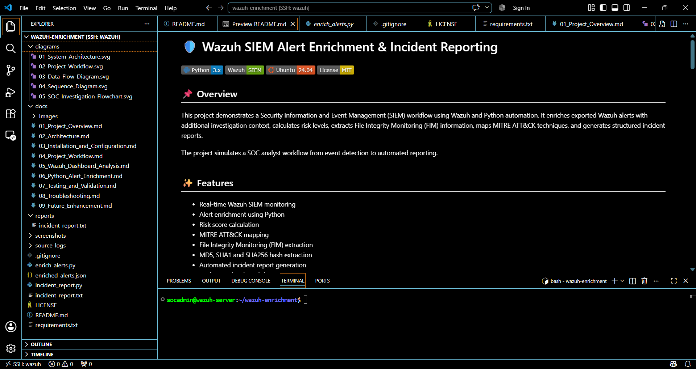

# Installation and Configuration

**Version:** 1.0

**Author:** Mahesh Tilot

---

# Purpose

This document describes the software requirements, laboratory environment, installation process, and configuration steps used to build the Wazuh SIEM Alert Enrichment & Incident Reporting project.

Following this guide will allow users to recreate a similar laboratory environment.

---

# Laboratory Environment

The project was developed in a virtualized laboratory environment to simulate a Security Operations Center (SOC) workflow.

## Development Environment

| Component | Description |
|-----------|-------------|
| Host Operating System | Windows 11 |
| Development Tool | Visual Studio Code |
| Remote Development | VS Code Remote SSH |
| Virtualization | VMware Workstation |
| Guest Operating System | Ubuntu Server |
| Programming Language | Python 3 |
| SIEM Platform | Wazuh |

---

# Software Requirements

Before beginning the installation, ensure the following software is available.

| Software | Purpose |
|----------|---------|
| VMware Workstation | Virtual Machine Platform |
| Ubuntu Server | Wazuh Server |
| Python 3 | Automation Scripts |
| Visual Studio Code | Development |
| Remote SSH Extension | Remote Development |
| Wazuh Platform | Security Monitoring |

---

# Laboratory Architecture

The implementation consists of the following components:

- Windows Host Machine
- Ubuntu Server Virtual Machine
- Wazuh Server
- Wazuh Dashboard
- Python Automation Scripts
- VS Code Remote Development

> **Note:** The Python scripts are executed on the Ubuntu Server through a secure Remote SSH connection from Visual Studio Code.

---

# Wazuh Installation

The Wazuh platform was installed on the Ubuntu Server virtual machine.

The installation includes:

- Wazuh Manager
- Wazuh Dashboard
- Wazuh Indexer

After installation, the following services were verified:

- Wazuh Manager
- Wazuh Dashboard
- Wazuh Indexer

---

# Development Environment

Visual Studio Code was used as the primary development environment.

Development activities included:

- Python scripting
- JSON analysis
- Remote editing
- Project documentation
- Report generation

Remote SSH was configured to connect directly to the Ubuntu Server.

---

# Project Configuration

The project directory contains:

```text
wazuh-enrichment/
│
├── docs/
├── diagrams/
├── reports/
├── screenshots/
├── source_logs/
│
├── enrich_alerts.py
├── incident_report.py
├── enriched_alerts.json
└── README.md
```

---

# Running the Project

The enrichment process is performed in two stages.

## Step 1 – Generate Enriched Alerts

```bash
sudo python3 enrich_alerts.py
```

Output:

```
enriched_alerts.json
```

---

## Step 2 – Generate Incident Report

```bash
sudo python3 incident_report.py
```

Output:

```
reports/incident_report.txt
```

---

# Verification

After execution, verify that:

- The enrichment script completes successfully.
- `enriched_alerts.json` is generated.
- `incident_report.txt` is created.
- Risk scores are present.
- MITRE ATT&CK mappings are included.
- FIM information is extracted.
- Hash values (MD5, SHA1, SHA256) are displayed correctly.

---

### Figure 1: Project Directory in VS Code



---

### Figure 2: Running `enrich_alerts.py`


---

### Figure 3: Running `incident_report.py`


---

### Figure 4: Generated Incident Report


---

## Key Takeaways

- A reproducible Wazuh SIEM lab was successfully configured.
- Python automation was integrated into the investigation workflow.
- VS Code Remote SSH enabled efficient remote development.
- The environment supports end-to-end security monitoring and alert enrichment.

# Conclusion

The installation and configuration described in this document provide a complete laboratory environment for demonstrating Wazuh SIEM monitoring, Python-based alert enrichment, and automated incident reporting. The configuration supports practical experimentation with SOC workflows while remaining reproducible for future development and learning.