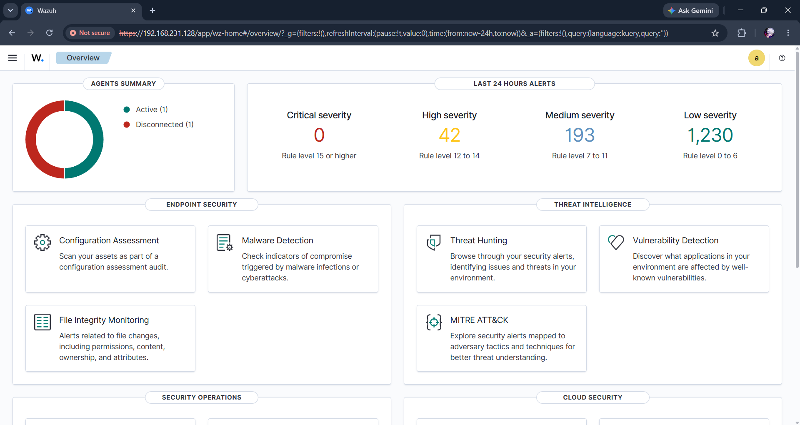
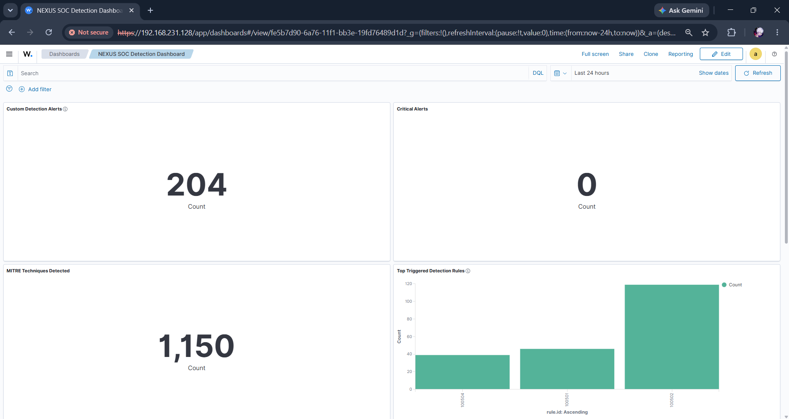
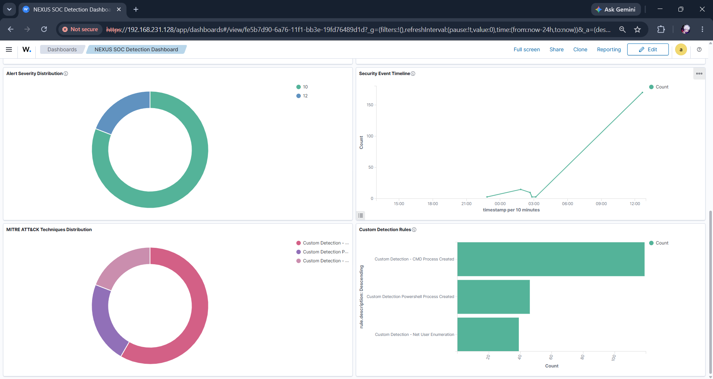
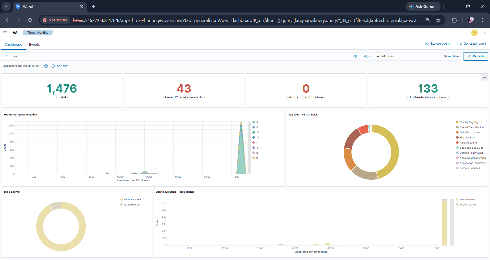
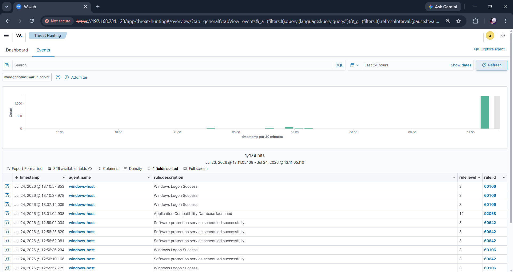

# Wazuh Dashboard Analysis

**Version:** 1.0

**Author:** Mahesh Tilot

---

# Purpose

This document explains the dashboards used throughout the Wazuh SIEM Alert Enrichment & Incident Reporting project. It describes the purpose of each dashboard, the information presented, and how the visualizations assist Security Operations Center (SOC) analysts during security investigations.

The dashboards provide centralized visibility into security events, alert trends, authentication activity, MITRE ATT&CK mappings, and custom detections generated within the laboratory environment.

---

# Dashboard Overview

Wazuh provides interactive dashboards that allow analysts to monitor the security posture of monitored systems in real time.

During this project, both the default Wazuh dashboards and a custom dashboard were used to analyze security events generated within the laboratory.

The dashboards provide immediate visibility into:

- Security alerts
- Authentication activity
- File Integrity Monitoring (FIM)
- MITRE ATT&CK techniques
- Event timelines
- Alert severity
- Detection rules
- Security trends

---

# Wazuh Overview Dashboard

The Wazuh Overview Dashboard provides a high-level summary of the monitored environment. It displays the overall health of the SIEM deployment and summarizes security events collected from connected endpoints.

Analysts use this dashboard as the starting point for monitoring daily security operations.

### Key Information Displayed

- Active security modules
- Security monitoring status
- Threat Hunting access
- Vulnerability Detection
- Configuration Assessment
- File Integrity Monitoring
- MITRE ATT&CK

**Figure 5.1 – Wazuh Overview Dashboard**

---

# NEXUS SOC Detection Dashboard

A custom dashboard named **NEXUS SOC Detection Dashboard** was developed to consolidate the most important security metrics into a single view.

Rather than navigating multiple dashboards, analysts can quickly identify abnormal activity through summarized visualizations.

### Dashboard Components

- Total Security Detections
- Critical Alerts
- MITRE ATT&CK Detections
- Alert Severity Distribution
- Top Triggered Detection Rules
- Authentication Events
- Security Timeline

### Operational Benefits

- Faster alert prioritization
- Improved security visibility
- Centralized monitoring
- Reduced investigation time
- Better situational awareness

**Figure 5.2 – NEXUS SOC Detection Dashboard**

---

# Threat Hunting Dashboard

The Threat Hunting Dashboard provides analysts with detailed visibility into security events and authentication activity.

It enables analysts to identify suspicious behaviour by reviewing event timelines, authentication attempts, and MITRE ATT&CK mappings.

### Information Available

- Authentication Success
- Authentication Failure
- Event Timeline
- Alert Severity
- MITRE ATT&CK Techniques
- Top Agents
- Security Event Trends

This dashboard supports proactive threat hunting by helping analysts identify unusual activity before it escalates into a security incident.

**Figure 5.3 – Threat Hunting Dashboard**

---

# Events Dashboard

The Events Dashboard displays individual security alerts generated by Wazuh.

Each event contains detailed investigation information including:

- Timestamp
- Rule ID
- Alert Description
- Agent Name
- Severity Level
- Event Source

Analysts can open individual events to review complete alert information before beginning an investigation.

**Figure 5.4 – Security Events Dashboard**

---

# Alert Severity Analysis

Security alerts are categorized according to their severity level.

Severity visualization allows analysts to quickly determine which alerts require immediate attention.

Benefits include:

- Rapid prioritization
- Improved incident response
- Better resource allocation
- Faster investigations

---

# MITRE ATT&CK Visualization

The dashboards display detected techniques mapped to the MITRE ATT&CK framework.

This allows analysts to understand attacker behaviour by categorizing events according to known tactics and techniques.

MITRE visualization improves:

- Threat classification
- Attack analysis
- Incident investigation
- Threat intelligence correlation

---

# Authentication Monitoring

Authentication activity represents an important indicator of system security.

The dashboards monitor:

- Successful logins
- Failed logins
- Authentication trends
- User activity

Monitoring authentication events helps analysts identify suspicious access attempts and potential account compromise.

---

# Dashboard Usage During Investigations

The dashboards support analysts throughout the investigation lifecycle.

Typical workflow:

1. Review dashboard alerts.
2. Identify high-severity events.
3. Analyze event details.
4. Review MITRE ATT&CK mapping.
5. Investigate authentication activity.
6. Export alert data.
7. Execute Python alert enrichment.
8. Generate the incident report.

---

# Key Takeaways

- Wazuh dashboards provide centralized visibility into security events.
- The custom NEXUS SOC Detection Dashboard improves analyst efficiency by consolidating critical information.
- Threat Hunting dashboards support proactive investigation of suspicious activity.
- Event dashboards provide detailed alert information required for incident response.
- MITRE ATT&CK visualization assists with threat classification and attacker behaviour analysis.

---

# Conclusion

The Wazuh dashboards play a central role in the investigation workflow implemented by this project. They provide analysts with real-time visibility into security events, support efficient threat hunting, and supply the contextual information required before alerts are enriched by the Python automation modules. Together, these dashboards form the operational foundation of the SIEM environment used throughout this project.