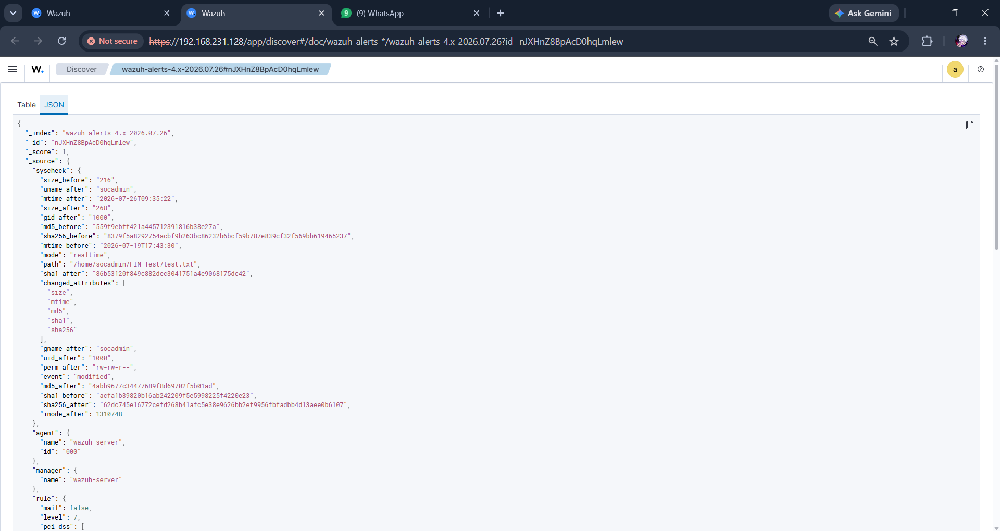
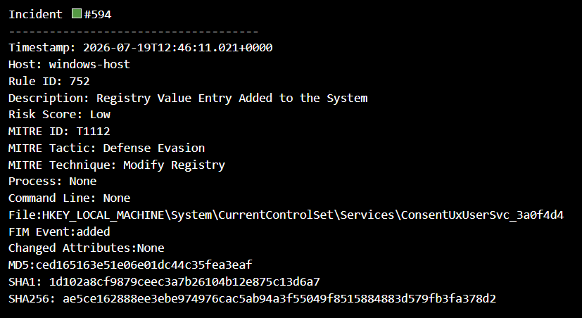

# Python Alert Enrichment

**Version:** 1.0

**Author:** Mahesh Tilot

---

# Purpose

This document explains the Python automation modules developed for this project. These modules extend the capabilities of Wazuh SIEM by enriching security alerts with additional investigation context and generating structured incident reports.

The automation reduces manual analysis while improving the quality and consistency of information available to Security Operations Center (SOC) analysts.

---

# Overview

The automation layer consists of two Python scripts:

1. **enrich_alerts.py**
2. **incident_report.py**

Together, these scripts transform raw Wazuh alerts into structured investigation-ready reports.

---

# Automation Workflow

```text
alerts.json
      │
      ▼
enrich_alerts.py
      │
 ┌────┼─────────────┐
 │    │             │
 ▼    ▼             ▼
Risk  MITRE     FIM Details
Score Mapping Hash Extraction
      │
      ▼
enriched_alerts.json
      │
      ▼
incident_report.py
      │
      ▼
incident_report.txt
```

---

# Script 1 – enrich_alerts.py

The enrichment engine processes exported Wazuh alerts and enhances each alert with additional investigation information.

Its responsibilities include:

- Reading Wazuh alert data
- Calculating risk scores
- Mapping MITRE ATT&CK techniques
- Extracting File Integrity Monitoring (FIM) information
- Extracting MD5, SHA1, and SHA256 hash values
- Creating enriched JSON output

---

# Risk Score Calculation

The enrichment engine assigns a risk score to each alert based on the alert severity generated by Wazuh.

The purpose of the risk score is to help analysts prioritize alerts during investigations.

Risk levels used in this project:

| Severity | Risk Level |
|-----------|------------|
| Low | Low Risk |
| Medium | Medium Risk |
| High | High Risk |

---

# MITRE ATT&CK Mapping

Where MITRE ATT&CK information is available, the enrichment engine extracts and preserves the associated techniques.

This allows analysts to understand the attack behaviour represented by the alert and supports threat classification.

---

# File Integrity Monitoring (FIM)

For File Integrity Monitoring alerts, the enrichment engine extracts:

- File Path
- FIM Event
- Changed Attributes
- MD5 Hash
- SHA1 Hash
- SHA256 Hash

This information assists analysts when investigating unauthorized file modifications.

---

# Enriched JSON Output

After processing, the script generates an enriched JSON file containing structured security information.

The output includes:

- Timestamp
- Host
- Rule Information
- Risk Score
- MITRE ATT&CK Mapping
- FIM Details
- Hash Values

**Figure 6.1 – Enriched JSON Output**



---

# Script 2 – incident_report.py

The reporting module converts enriched JSON alerts into a structured incident report.

The generated report improves readability and provides investigation-ready documentation.

---

# Incident Report Contents

Each report contains:

- Incident Timestamp
- Host Information
- Rule Details
- Alert Description
- Risk Score
- MITRE ATT&CK Mapping
- File Integrity Monitoring Details
- MD5 Hash
- SHA1 Hash
- SHA256 Hash

### Figure 6.2 - Incident Report



---

# Automation Benefits

The Python automation provides several advantages:

- Automated alert enrichment
- Reduced manual effort
- Faster investigations
- Consistent reporting
- Improved analyst efficiency
- Better investigation context

---

# Key Takeaways

- Python extends the investigative capabilities of Wazuh SIEM.
- Alert enrichment adds valuable context for SOC analysts.
- Risk scores assist with alert prioritization.
- MITRE ATT&CK mapping improves threat classification.
- File Integrity Monitoring details support forensic investigations.
- Automated incident reporting improves consistency and reduces manual effort.

---

# Conclusion

The Python automation modules form the analytical core of this project by transforming raw Wazuh alerts into structured, investigation-ready outputs. Through alert enrichment, risk scoring, MITRE ATT&CK mapping, File Integrity Monitoring analysis, and automated report generation, the solution demonstrates how automation can enhance the efficiency of modern SOC workflows.